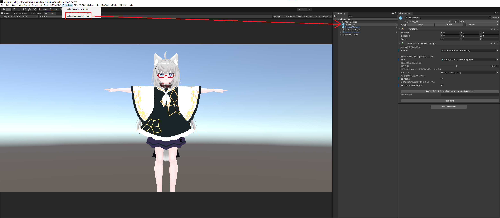
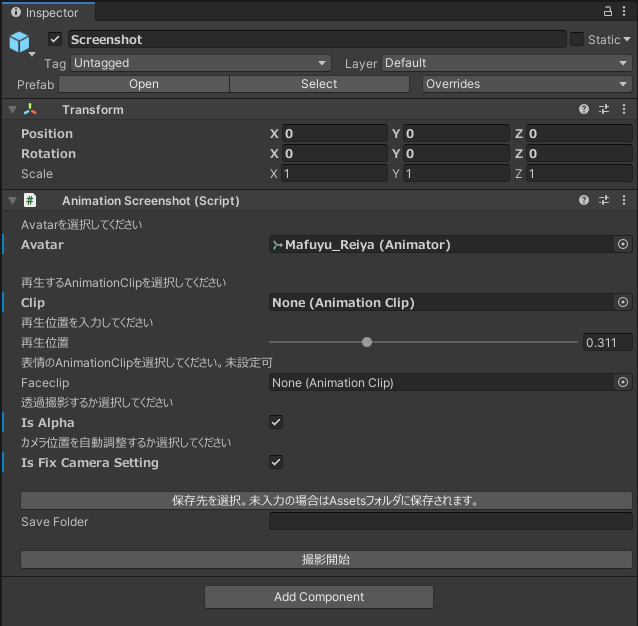
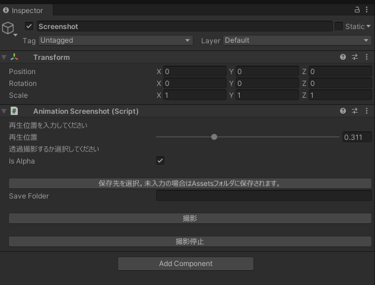

# UnityScreenshot
UnityProject上で高解像度スクリーンショットと背景透過スクリーンショットを取るためのエディタ拡張です。  

## 導入手順
1.最新のUnityPackageをインストールします。[ダウンロード先](https://github.com/Reiya1013/UnityScreenshot/releases)    
2.メニューからReiyaShop -> Add Screenshot Inspector を選択することで、HierarchyにScreenshot撮影用のGameobjectが追加されます。

## 撮影方法
1.Screenshotオブジェクトに以下の項目を設定します。
［撮影開始前］
Avatar：撮影時にAnimationを設定したいアバターを指定します。Hierarchyに存在する必要があります。  
Clip：アバターに反映するAnimationClipを設定します。  
再生位置：Clipの再生位置を指定します。後からも変更可能です。  
FaceClip：表情のAnimationClipを設定します。未設定でも大丈夫です。  
Is Alpha：透過撮影するかのフラグです。チェックONで透過撮影します。  
Is Fix Camera Setting：カメラ設定をある程度自動でしてくれるフラグです。チェックONで撮影開始時に初期設定します。  
Save Folder：保存先を指定します。保存先指定ボタンでダイアログが表示されるのでそちらから設定も可能です。未設定の場合、Assetsフォルダに保存されます。  
撮影開始ボタン：シーンを再生して撮影モードに入ります。  

［撮影中］
再生位置：Clipの再生位置を指定します。
Save Folder：保存先を指定します。保存先指定ボタンでダイアログが表示されるのでそちらから設定も可能です。未設定の場合、Assetsフォルダに保存されます。
撮影ボタン：スクリーンショットを撮影して保存します。
撮影停止ボタン：終了ボタン。

2.設定が完了したら、撮影開始ボタンを実行し、再生位置調整後撮影ボタンを押下してください。    

## 注意  
Cameraを後で作った場合はCameraのTagをMainCameraに変更してください。  
設定を行わないと、透過スクリーンショットは取れません。  

## バグ報告 

下記にお願いいたします。  
Twitter:[Reiya](https://twitter.com/Reiya__)  

## ライセンス

MIT license
